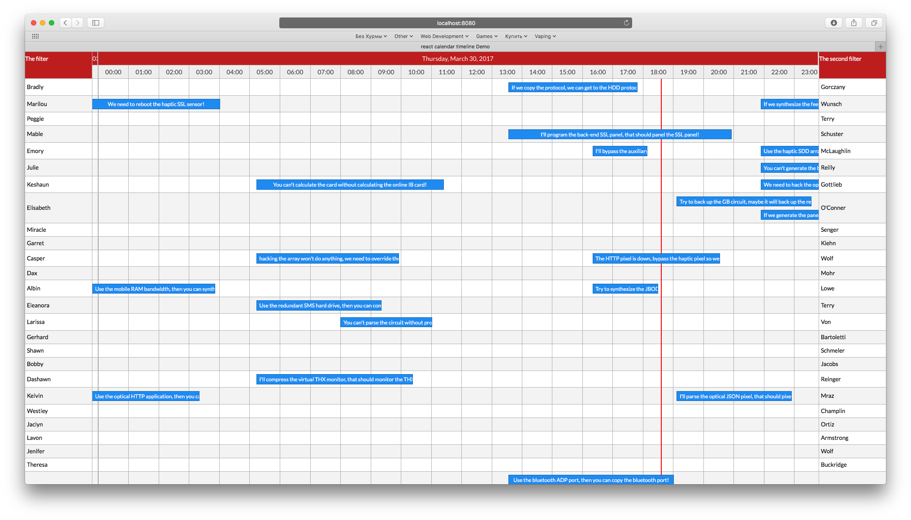

# React Calendar Timeline

A modern and responsive react timeline component.


Checkout the [examples here](https://github.com/namespace-ee/react-calendar-timeline/tree/master/examples)!

# Getting started

```bash
# via yarn
yarn add react-calendar-timeline

# via npm
npm install --save react-calendar-timeline
```

`react-calendar-timeline` has `react`, `react-dom`, [`moment`](http://momentjs.com/) and [`interactjs`](http://interactjs.io/docs/) as peer dependencies.

# Usage

At the very minimum:

```jsx
import Timeline from 'react-calendar-timeline'
// make sure you include the timeline stylesheet or the timeline will not be styled
import 'react-calendar-timeline/lib/Timeline.css'
import moment from 'moment'

const groups = [{ id: 1, title: 'group 1' }, { id: 2, title: 'group 2' }]

const items = [
  {
    id: 1,
    group: 1,
    title: 'item 1',
    start_time: moment(),
    end_time: moment().add(1, 'hour')
  },
  {
    id: 2,
    group: 2,
    title: 'item 2',
    start_time: moment().add(-0.5, 'hour'),
    end_time: moment().add(0.5, 'hour')
  },
  {
    id: 3,
    group: 1,
    title: 'item 3',
    start_time: moment().add(2, 'hour'),
    end_time: moment().add(3, 'hour')
  }
]

ReactDOM.render(
  <div>
    Rendered by react!
    <Timeline
      groups={groups}
      items={items}
      defaultTimeStart={moment().add(-12, 'hour')}
      defaultTimeEnd={moment().add(12, 'hour')}
    />
  </div>,
  document.getElementById('root')
)
```

# API

_NB!_ All props need to be immutable. For example, this means if you wish to change the title of one of your items, please pass in a whole new items array instead of changing the title in the old array. [Here's more info.](http://reactkungfu.com/2015/08/pros-and-cons-of-using-immutability-with-react-js/)

The component can take many props:

## groups

Expects either a vanilla JS array or an immutableJS array, consisting of objects with the following attributes:

```js
{
  id: 1,
  title: 'group 1',
  rightTitle: 'title in the right sidebar',
}
```

If you use right sidebar, you can pass optional `rightTitle` property here.
If you want to overwrite the calculated height with a custom height, you can pass a `height` property as an int in pixels here. This can be very useful for categorized groups.

## items

Expects either a vanilla JS array or an immutableJS array, consisting of objects with the following attributes:

```js
{
  id: 1,
  group: 1,
  title: 'Random title',
  start_time: 1457902922261,
  end_time: 1457902922261 + 86400000,
  canMove: true,
  canResize: false,
  canChangeGroup: false,
  className: 'weekend',
  style: {
    backgroundColor: 'fuchsia'
  },
  itemProps: {
    // these optional attributes are passed to the root <div /> of each item as <div {...itemProps} />
    'data-custom-attribute': 'Random content',
    'aria-hidden': true,
    onDoubleClick: () => { console.log('You clicked double!') }
  }
}
```

The preferred (fastest) option is to give unix timestamps in milliseconds for `start_time` and `end_time`. Objects that convert to them (JavaScript Date or moment()) will also work, but will be a lot slower.

## defaultTimeStart and defaultTimeEnd

Unless overridden by `visibleTimeStart` and `visibleTimeEnd`, specify where the calendar begins and where it ends. This parameter expects a Date or moment object.

## visibleTimeStart and visibleTimeEnd

The exact viewport of the calendar. When these are specified, scrolling in the calendar must be orchestrated by the `onTimeChange` function. This parameter expects a unix timestamp in milliseconds.

**Note that you need to provide either `defaultTimeStart/End` or `visibleTimeStart/End` for the timeline to function**

## selected

An array with id's corresponding to id's in items (`item.id`). If this prop is set you have to manage the selected items yourself within the `onItemSelect` handler to update the property with new id's. This overwrites the default behaviour of selecting one item on click.

## keys

An array specifying keys in the `items` and `groups` objects. Defaults to

```js
{
  groupIdKey: 'id',
  groupTitleKey: 'title',
  groupRightTitleKey: 'rightTitle',
  itemIdKey: 'id',
  itemTitleKey: 'title',    // key for item div content
  itemDivTitleKey: 'title', // key for item div title (<div title="text"/>)
  itemGroupKey: 'group',
  itemTimeStartKey: 'start_time',
  itemTimeEndKey: 'end_time'
}
```

## sidebarWidth

Width of the sidebar in pixels. If set to `0`, the sidebar is not rendered. Defaults to `150`.

## sidebarContent

Everything passed here will be displayed above the left sidebar. Use this to display small filters or so. Defaults to `null`.

## rightSidebarWidth

Width of the right sidebar in pixels. If set to `0`, the right sidebar is not rendered. Defaults to `0`.

## rightSidebarContent

Everything passed here will be displayed above the right sidebar. Use this to display small filters or so. Defaults to `null`.

## dragSnap

Snapping unit when dragging items. Defaults to `15 * 60 * 1000` or 15min. When so, the items will snap to 15min intervals when dragging.

## minResizeWidth

The minimum width, in pixels, of a timeline entry when it's possible to resize. If not reached, you must zoom in to resize more. Default to `20`.

## stickyOffset

At what height from the top of the screen should we start "sticking" the header (i.e. position: sticky)? This is useful if for example you already have
a sticky navbar and want to push the timeline header down further. Defaults `0`.

## stickyHeader

Specify whether you want the timeline header to be "sticky". Pass `false` if you want the header to fix at top of element and not fix when you scroll down the page. Defaults to `true`

## headerRef

Ref callback that gets a DOM reference to the header element. See [FAQ below](#the-timeline-header-doesnt-fix-to-the-top-of-the-container-when-i-scroll-down).

## lineHeight

Height of one line in the calendar in pixels. Default `30`

## headerLabelGroupHeight

Height of the top header line. Default `30`

## headerLabelHeight

Height of the bottom header line. Default `30`

## itemHeightRatio

What percentage of the height of the line is taken by the item? Default `0.65`

## minZoom

Smallest time the calendar can zoom to in milliseconds. Default `60 * 60 * 1000` (1 hour)

## maxZoom

Largest time the calendar can zoom to in milliseconds. Default `5 * 365.24 * 86400 * 1000` (5 years)

## clickTolerance

How many pixels we can drag the background for it to be counted as a click on the background. Defualt: `3`

## canMove

Can items be dragged around? Can be overridden in the `items` array. Defaults to `true`

## canChangeGroup

Can items be moved between groups? Can be overridden in the `items` array. Defaults to `true`

## canResize

Can items be resized? Can be overridden in the `items` array. Accepted values: `false`, `"left"`, `"right"`, `"both"`. Defaults to `"right"`. If you pass `true`, it will be treated as `"right"` to not break compatibility with versions 0.9 and below.

## useResizeHandle

Append a special `.rct-drag-right` handle to the elements and only resize if dragged from there. Defaults to `false`

### stackItems

Stack items under each other, so there is no visual overlap when times collide. Defaults to `false`.

## traditionalZoom

Zoom in when scrolling the mouse up/down. Defaults to `false`

## itemTouchSendsClick

Normally tapping (touching) an item selects it. If this is set to true, a tap will have the same effect, as selecting with the first click and then clicking again to open and send the onItemClick event. Defaults to `false`.

## timeSteps

With what step to display different units. E.g. `15` for `minute` means only minutes 0, 15, 30 and 45 will be shown.

Default:

```js
{
  second: 1,
  minute: 1,
  hour: 1,
  day: 1,
  month: 1,
  year: 1
}
```

## scrollRef

Ref callback that gets a DOM reference to the scroll body element. Can be useful to programmatically scroll.

## onItemMove(itemId, dragTime, newGroupOrder)

Callback when an item is moved. Returns 1) the item's ID, 2) the new start time and 3) the index of the new group in the `groups` array.

## onItemResize(itemId, time, edge)

Callback when an item is resized. Returns 1) the item's ID, 2) the new start or end time of the item 3) The edge that was dragged (`left` or `right`)

## onItemSelect(itemId, e, time)

Called when an item is selected. This is sent on the first click on an item. `time` is the time that corresponds to where you click/select on the item in the timeline.

## onItemClick(itemId, e, time)

Called when an item is clicked. Note: the item must be selected before it's clicked... except if it's a touch event and `itemTouchSendsClick` is enabled. `time` is the time that corresponds to where you click on the item in the timeline.

## onItemDoubleClick(itemId, e, time)

Called when an item was double clicked. `time` is the time that corresponds to where you double click on the item in the timeline.

## onItemContextMenu(itemId, e, time)

Called when the item is clicked by the right button of the mouse. `time` is the time that corresponds to where you context click on the item in the timeline. Note: If this property is set the default context menu doesn't appear.

## onCanvasClick(groupId, time, e)

Called when an empty spot on the canvas was clicked. Get the group ID and the time as arguments. For example open a "new item" window after this.

## onCanvasDoubleClick(group, time, e)

Called when an empty spot on the canvas was double clicked. Get the group and the time as arguments.

## onCanvasContextMenu(group, time, e)

Called when the canvas is clicked by the right button of the mouse. Note: If this property is set the default context menu doesn't appear

## onZoom(timelineContext)

Called when the timeline is zoomed, either via mouse/pinch zoom or clicking header to change timeline units

## moveResizeValidator(action, itemId, time, resizeEdge)

This function is called when an item is being moved or resized. It's up to this function to return a new version of `change`, when the proposed move would violate business logic.

The argument `action` is one of `move` or `resize`.

The argument `resizeEdge` is when resizing one of `left` or `right`.

The argument `time` describes the proposed new time for either the start time of the item (for move) or the start or end time (for resize).

The function must return a new unix timestamp in milliseconds... or just `time` if the proposed new time doesn't interfere with business logic.

For example, to prevent moving of items into the past, but to keep them at 15min intervals, use this code:

```js
function (action, item, time, resizeEdge) {
  if (time < new Date().getTime()) {
    var newTime = Math.ceil(new Date().getTime() / (15*60*1000)) * (15*60*1000);
    return newTime;
  }

  return time
}
```

## headerLabelFormats and subHeaderLabelFormats

The formats passed to moment to render times in the header and subheader. Defaults to these:

```js
import {
  defaultHeaderLabelFormats,
  defaultSubHeaderLabelFormats
} from 'react-calendar-timeline'

defaultHeaderLabelFormats ==
  {
    yearShort: 'YY',
    yearLong: 'YYYY',
    monthShort: 'MM/YY',
    monthMedium: 'MM/YYYY',
    monthMediumLong: 'MMM YYYY',
    monthLong: 'MMMM YYYY',
    dayShort: 'L',
    dayLong: 'dddd, LL',
    hourShort: 'HH',
    hourMedium: 'HH:00',
    hourMediumLong: 'L, HH:00',
    hourLong: 'dddd, LL, HH:00',
    time: 'LLL'
  }

defaultSubHeaderLabelFormats ==
  {
    yearShort: 'YY',
    yearLong: 'YYYY',
    monthShort: 'MM',
    monthMedium: 'MMM',
    monthLong: 'MMMM',
    dayShort: 'D',
    dayMedium: 'dd D',
    dayMediumLong: 'ddd, Do',
    dayLong: 'dddd, Do',
    hourShort: 'HH',
    hourLong: 'HH:00',
    minuteShort: 'mm',
    minuteLong: 'HH:mm'
  }
```

For US time formats (AM/PM), use these:

```js
import {
  defaultHeaderLabelFormats,
  defaultSubHeaderLabelFormats
} from 'react-calendar-timeline'

const usHeaderLabelFormats = Object.assign({}, defaultSubHeaderLabelFormats, {
  hourShort: 'h A',
  hourMedium: 'h A',
  hourMediumLong: 'L, h A',
  hourLong: 'dddd, LL, h A'
})

const usSubHeaderLabelFormats = Object.assign(
  {},
  defaultSubHeaderLabelFormats,
  {
    hourShort: 'h A',
    hourLong: 'h A',
    minuteLong: 'h:mm A'
  }
)
```

... and then pass these as `headerLabelFormats` and `subHeaderLabelFormats`

## onTimeChange(visibleTimeStart, visibleTimeEnd, updateScrollCanvas)

A function that's called when the user tries to scroll. Call the passed `updateScrollCanvas(start, end)` with the updated visibleTimeStart and visibleTimeEnd (as unix timestamps in milliseconds) to change the scroll behavior, for example to limit scrolling.

Here is an example that limits the timeline to only show dates starting 6 months from now and ending in 6 months.

```js
// this limits the timeline to -6 months ... +6 months
const minTime = moment().add(-6, 'months').valueOf()
const maxTime = moment().add(6, 'months').valueOf()

function (visibleTimeStart, visibleTimeEnd, updateScrollCanvas) {
  if (visibleTimeStart < minTime && visibleTimeEnd > maxTime) {
    updateScrollCanvas(minTime, maxTime)
  } else if (visibleTimeStart < minTime) {
    updateScrollCanvas(minTime, minTime + (visibleTimeEnd - visibleTimeStart))
  } else if (visibleTimeEnd > maxTime) {
    updateScrollCanvas(maxTime - (visibleTimeEnd - visibleTimeStart), maxTime)
  } else {
    updateScrollCanvas(visibleTimeStart, visibleTimeEnd)
  }
}
```

## onBoundsChange(canvasTimeStart, canvasTimeEnd)

Called when the bounds in the calendar's canvas change. Use it for example to load new data to display. (see "Behind the scenes" below). `canvasTimeStart` and `canvasTimeEnd` are unix timestamps in milliseconds.

## itemRenderer

Render prop function used to render a customized item. The function provides multiple paramerters that can be used to render each item.

Paramters provided to the function has two types: context params which have the state of the item and timeline, and prop getters functions

#### Render props params

##### context

* `item` has the item we passed as a prop to the calendar.

* `timelineContext`

| property           | type     | description                                          |
| ------------------ | -------- | ---------------------------------------------------- |
| `timelineWidth`    | `number` | returns the full width of the timeline.              |
| `visibleTimeStart` | `number` | returns the exact start of view port of the calender |
| `visibleTimeEnd`   | `number` | returns the exact end of view port of the calender.  |
| `canvasTimeStart`  | `number` | denotes the start time in ms of the canvas timeline  |
| `canvasTimeEnd`    | `number` | denotes the end time in ms of the canvas timeline    |

* `itemContext`

| property          | type            | description                                                                                                                                                               |
| ----------------- | --------------- | ------------------------------------------------------------------------------------------------------------------------------------------------------------------------- |
| `dimensions`      | `object`        | returns the dimensions of the item which includes `collisionLeft`, `collisionWidth`, `height`, `isDragging`, `left`, `order`, `originalLeft`, `stack`, `top`, and `width` |
| `useResizeHandle` | `boolean`       | returns the prop `useResizeHandle` from calendar root component                                                                                                           |
| `title`           | `string`        | returns title to render in content element.                                                                                                                               |
| `canMove`         | `boolean`       | returns if the item is movable.                                                                                                                                           |
| `canResizeLeft`   | `boolean`       | returns if the item can resize from the left                                                                                                                              |
| `canResizeRight`  | `boolean`       | returns if the item can resize from the right.                                                                                                                            |
| `selected`        | `boolean`       | returns if the item is selected.                                                                                                                                          |
| `dragging`        | `boolean`       | returns if the item is being dragged                                                                                                                                      |
| `dragStart`       | `object`        | returns `x` and `y` of the start dragging point of the item.                                                                                                              |
| `dragGroupDelta`  | `number`        | returns number of groups the item moved. if negative, moving was to top. If positive, moving was to down                                                                  |
| `resizing`        | `boolean`       | returns if the item is being resized.                                                                                                                                     |
| `resizeEdge`      | `left`, `right` | the side from which the component is being resized form                                                                                                                   |
| `resizeStart`     | `number`        | returns the x value from where the component start moving                                                                                                                 |
| `width`           | `boolean`       | returns the width of the item (same as in dimensions)                                                                                                                     |

##### prop getters functions

These functions are used to apply props to the elements that you render. This gives you maximum flexibility to render what, when, and wherever you like.

Rather than applying props on the element yourself and to avoid your props being overridden (or overriding the props returned). You can pass an object to the prop getters to avoid any problems. This object will only accept some properties that our component manage so the component make sure to combine them correctly.

| property         | type                 | description                                                                                                                               |
| ---------------- | -------------------- | ----------------------------------------------------------------------------------------------------------------------------------------- |
| `getItemProps`   | `function(props={})` | returns the props you should apply to the root item element.                                                                              |
| `getResizeProps` | `function(props={})` | returns two sets of props to apply on the `left` and `right` elements as resizing elements if you have `useResizeHandle` prop set to true |

* `getItemProps` returns the props you should apply to the root item element. The returned props are:

  * key: item id
  * ref: function to get item referance
  * className: classnames to be applied to the item
  * onMouseDown: event handler
  * onMouseUp: event handler
  * onTouchStart: event handler
  * onTouchEnd: event handler
  * onDoubleClick: event handler
  * onContextMenu: event handler
  * style: inline object style

  \*\* _the given styles will only override the styles that are not a requirement for postioning the item. Other styles like `color`, `radius` and others_

  These properties can be override using the prop argument with proprties:

  * className: class names to be added
  * onMouseDown: event handler will be called after the component's event handler
  * onMouseUp: event handler will be called after the component's event handler
  * onTouchStart: event handler will be called after the component's event handler
  * onTouchEnd: event handler will be called after the component's event handler
  * onDoubleClick: event handler will be called after the component's event handler
  * onContextMenu: event handler will be called after the component's event handler
  * style: extra inline styles to be applied to the component

* `getResizeProps` returns the props you should apply to the left and right resize handlers only if `useResizeHandle` set to true. The returned object has the props for the left element under property `left` and the props to be applied to the right element under `right` :

  * left
    * ref: function to get element referance
    * style: style to be applied to the left element
  * right
    * ref: function to get element referance
    * style: style to be applied to the right element

These properties can be override using the prop argument with proprties:

* leftStyle: style to be added to left style
* rightStyle: style to be added to right style

example

```jsx
let items = [
  {
    id: 1,
    group: 1,
    title: 'Title',
    tip: 'additional information',
    color: 'rgb(158, 14, 206)',
    selectedBgColor: 'rgba(225, 166, 244, 1)',
    bgColor : 'rgba(225, 166, 244, 0.6)',
    ...
  }
]

itemRenderer: ({
  item,
  timelineContext,
  itemContext,
  getItemProps,
  getResizeProps,
}) => {
  const { left: leftResizeProps, right: rightResizeProps } = getResizeProps()
  return (
    <div
      {...getItemProps(item.itemProps) }
    >
      {itemContext.useResizeHandle && itemContext.showInnerContentsRender ? (
        <div {...leftResizeProps} />
      ) : (
          ''
        )}

      {itemContext.showInnerContentsRender && <div
        className="rct-item-content"
        style={{maxHeight: `${itemContext.dimensions.height}`}}
      >
        {itemContext.title}
      </div>}


      {itemContext.useResizeHandle && itemContext.showInnerContentsRender ? (
        <div {...rightResizeProps} />
      ) : (
          ''
        )}
    </div>
  )
}
```

## groupRenderer

React component that will be used to render the content of groups in the
sidebar. Will be passed the `group` and `isRightSidebar` as props.

```jsx
let groups = [
  {
    id: 1,
    title: 'Title',
    tip: 'additional information'
  }
]

groupRenderer = ({ group }) => {
  return (
    <div className="custom-group">
      <span className="title">{group.title}</span>
      <p className="tip">{group.tip}</p>
    </div>
  )
}
```

## resizeDetector

The component automatically detects when the window has been resized. Optionally you can also detect when the component's DOM element has been resized.
To do this, pass a `resizeDetector`. Since bundling it by default would add ~18kb of minimized JS, you need to opt in to this like so:

```jsx
import containerResizeDetector from 'react-calendar-timeline/lib/resize-detector/container'

<Timeline resizeDetector={containerResizeDetector} ... />
```

## verticalLineClassNamesForTime(start, end)

This function is called when the vertical line is rendered. `start` and `end` are unix timestamps in milliseconds for the current column. The function should return an array of strings containing the classNames which should be applied to the column. This makes it possible to visually highlight e.g. public holidays or office hours.
An example could look like (see: demo/vertical-classes):

```jsx
verticalLineClassNamesForTime = (timeStart, timeEnd) => {
  const currentTimeStart = moment(timeStart)
  const currentTimeEnd = moment(timeEnd)

  for (let holiday of holidays) {
    if (
      holiday.isSame(currentTimeStart, 'day') &&
      holiday.isSame(currentTimeEnd, 'day')
    ) {
      return ['holiday']
    }
  }
}
```

Be aware that this function should be as optimized for performance as possible as it will be called on each render of the timeline (i.e. when the canvas is reset, when zooming, etc)

## horizontalLineClassNamesForGroup(group)

This function is called when the horizontal line is rendered. `group` is the group which will be rendered into the current row. The function should return an array of strings containing the classNames which should be applied to the row. This makes it possible to visually highlight categories or important items.
An example could look like:

```jsx
horizontalLineClassNamesForGroup={(group) => group.root ? ["row-root"] : []}
```

# Timeline Markers

Timeline markers are markers that are overlayed on the canvas at specific datepoints.

## Overview

Markers can be placed in the Timeline by declaring them as `children` of the `Timeline` component:

```jsx
import Timeline, {
  TimelineMarkers,
  CustomMarker,
  TodayMarker,
  CursorMarker
} from 'react-calendar-timeline'

<Timeline>
  <TimelineMarkers>
    <TodayMarker />
    <CustomMarker date={today} />
    <CustomMarker date={tomorrow}>
      {/* custom renderer for this marker */}
      {({ styles, date }) => {
        const customStyles = {
          ...styles,
          backgroundColor: 'deeppink',
          width: '4px'
        }
        return <div style={customStyles} onClick={someCustomHandler} />
      }}
    </CustomMarker>
    <CursorMarker />
  </TimelineMarkers>
</Timeline>
```

Each marker allows for passing in a custom renderer via a [function as a child component](https://medium.com/merrickchristensen/function-as-child-components-5f3920a9ace9). This allows the user to render whatever they want (event handlers, custom styling, etc). This custom renderer receives an object with two properties:

> styles: {position: 'absolute', top: 0, bottom: 0, left: number}

This object _must_ be passed to the root component's `style` prop in order to be rendered properly. Note that you can merge this object with any other properties.

> date: number

Date in unix timestamp of this marker. This can be used to change how your marker is rendered (or if its rendered at all)

## TimelineMarkers

Wrapper for timeline markers that you want rendered.

## TodayMarker

Marker that is placed on the current date/time.

> interval: number | default: 10000

How often the TodayMarker refreshes. Value represents milliseconds.

> children: function({styles: object, date: number}) => JSX.Element

Custom renderer for this marker. Ensure that you always pass `styles` to the root component's `style` prop as this object contains positioning of the marker.

```jsx
// custom interval
const twoSeconds = 2000

<TodayMarker interval={twoSeconds} />

//custom renderer

<TodayMarker>
  {({ styles, date }) =>
  // date is value of current date. Use this to render special styles for the marker
  // or any other custom logic based on date:
  // e.g. styles = {...styles, backgroundColor: isDateInAfternoon(date) ? 'red' : 'limegreen'}
  return <div style={styles} />
  }
</TodayMarker>
```

## CustomMarker

Marker that is placed on the current date/time.

> date: number | required

Where to place the marker on the timeline. `date` value is unix timestamp.

> children: function({styles: object, date: number}) => JSX.Element

Custom renderer for this marker. Ensure that you always pass `styles` to the root component's `style` prop as this object contains positioning of the marker.

```jsx
const today = Date.now()
<CustomMarker date={today} />

//custom renderer
<CustomMarker date={today}>
  {({ styles, date }) =>
  return <div style={styles} />
  }
</CustomMarker>

// multiple CustomMarkers
const markerDates = [
  {date: today, id: 1,},
  {date: tomorrow, id: 2,},
  {date: nextFriday, id: 3,},
]

<TimelineMarkers>
  {markerDates.map(marker => <CustomMarker key={marker.date} date={marker.date}/> )}
</TimelineMarkers>
```

## CursorMarker

Marker that is displayed when hovering over the timeline and matches where your cursor is.

> children: function({styles: object, date: number}) => JSX.Element

Custom renderer for this marker. Ensure that you always pass `styles` to the root component's `style` prop as this object contains positioning of the marker.

```jsx
// render default marker for Cursor
<CursorMarker />

//custom renderer
<CursorMarker>
  {({ styles, date }) =>
  // date is value of current date. Use this to render special styles for the marker
  // or any other custom logic based on date:
  // e.g. styles = {...styles, backgroundColor: isDateInAfternoon(date) ? 'red' : 'limegreen'}
  return <div style={styles} />
  }
</CursorMarker>
```

# FAQ

## My timeline is unstyled

You need to include the `Timeline.css` file, either via static file reference or webpack stylesheet bundling. The file is located at `lib/Timeline.css`

## How can I have items with different colors?

[Items](https://github.com/namespace-ee/react-calendar-timeline#items) have a "className" parameter. For example if you have "standard" items and "analysis" items, then you can just add an "analysis" class for your analysis items and then change the css backgroundColor property for them.

You will then need to override the default CSS rule:

```css
.react-calendar-timeline .rct-items .rct-item.analysis {
  background-color: #68efad;
}
```

## How can I add a sidebar on the right?

The library supports right sidebar.


To use it, you need to add two props to the `<Timeline />` component:

```jsx
rightSidebarWidth={150}
rightSidebarContent={<p>Second filter</p>}
```

And add `right_sidebar` prop to the groups objects:

```js
{
  id: 1,
  title: 'group 1',
  right_sidebar: 'additional info about group 1'
}
```

## The timeline header doesn't fix to the top of the container when I scroll down.

There are two causes of this:

* you are passing `stickyHeader={false}` to the timeline component. The header by default has sticky behavior unless you tell it not to using this prop.
* the browser you are viewing the timeline in doesn't support `position: sticky`. In this scenario, you will need to polyfill this behavior using the `headerRef`.

In this example, we use [stickyfill](https://github.com/wilddeer/stickyfill) as our sticky polyfill

```jsx
// add a handler in your parent component that accepts a DOM element
// with this element, pass the element into a polyfill library

handleHeaderRef = (el) => {
  // polyfill dom element with stickyfill
  Stickyfill.addOne(el)
}

// in render, pass this handler to the `headerRef` prop:

render() {
  <Timeline
  //other props
  headerRef={this.handleHeaderRef}

  />
}
```

## I'm using Babel with Rollup or Webpack 2+ and I'm getting strange bugs with click events

These module bundlers don't use the transpiled (ES5) code of this module. They load the original ES2015+ source. Thus your babel configuration needs to match ours. We recommend adding the [`stage-0` preset](https://babeljs.io/docs/plugins/preset-stage-0/) to your `.babelrc` to make sure everything works as intended.

If that's too experimental, then the minimum you need is to add is the [`transform-class-properties`](https://babeljs.io/docs/plugins/transform-class-properties/) plugin that's in stage-2 and possibly the [`transform-object-rest-spread`](https://babeljs.io/docs/plugins/transform-object-rest-spread/) plugin from stage-3. However in this case it's easier to make sure you have at least [`stage-2`](https://babeljs.io/docs/plugins/preset-stage-2/) enabled.

See [issue 51](https://github.com/namespace-ee/react-calendar-timeline/issues/51) for more details.

Alternatively you may import the transpiled version of the timeline like this:

```js
// import Timeline from 'react-calendar-timeline'  // ESnext version
import Timeline from 'react-calendar-timeline/lib' // ES5 version
```

However doing so you lose on some of the features of webpack 2 and will potentially get a slightly larger bundle.

## It doesn't work with `create-react-app`

It's the same issue as above. See [issue 134](https://github.com/namespace-ee/react-calendar-timeline/issues/134#issuecomment-314215244) for details and options.

## What are the zIndex values for all the elements?

This is useful when using the plugins (that you pass as children to the component). Override the CSS to change:

* Horizontal Lines: 30
* Vertical Lines: 40
* Items: 80-88 (depending on selection, dragging, etc)
* Header: 90

## Behind the scenes

The timeline is built with speed, usability and extensibility in mind.

Speed: The calendar itself is actually a 3x wide scrolling canvas of the screen. All scroll events left and right happen naturally, like scrolling any website. When the timeline has scrolled enough (50% of the invisible surface on one side), we change the "position:absolute;left:{num}px;" variables of each of the visible items and scroll the canvas back. When this happens, the `onBoundsChange` prop is called.

This results in a visually endless scrolling canvas with optimal performance.

Extensibility and usability: While some parameters (`onTimeChange`, `moveResizeValidator`) might be hard to configure, these are design decisions to make it as extensible as possible. If you have recipes for common tasks regarding those parameters, send a PR to add them to this doc.

## Interaction

To interact and navigate within the timeline there are the following options for the user:

```
shift + mousewheel = move timeline left/right
alt + mousewheel = zoom in/out
ctrl + mousewheel = zoom in/out 10× faster
meta + mousewheel = zoom in/out 3x faster (win or cmd + mousewheel)
```

Plus there is a handling for pinch-in and pinch-out zoom gestures (two touch points).
The pinch gesture on a trackpad (not a touch device) works in Chrome and Firefox (v55+) because these browsers map the gesture to `ctrl + mousewheel`.

## Contribute

If you like to improve React Calendar Timeline fork the repo and get started by running the following:

```bash
$ git clone https://github.com/namespace-ee/react-calendar-timeline.git react-calendar-timeline
$ cd react-calendar-timeline
$ yarn
$ yarn start
```

Check http://0.0.0.0:8888/ in your browser and have fun!

Please run `npm run lint` before you send a pull request. `npm run jest` runs the tests.

<!--

If you are core member team to patch npm run:

```bash
npm version patch
```

-->
