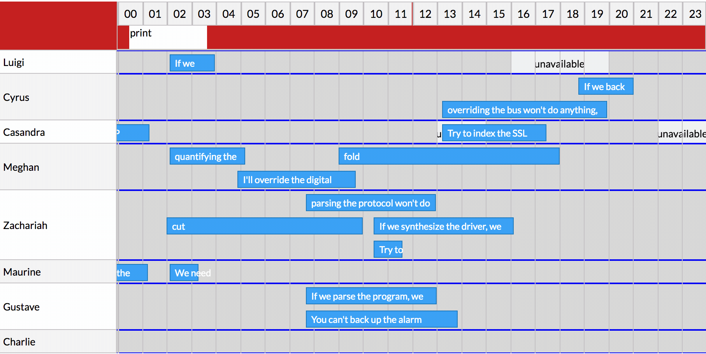
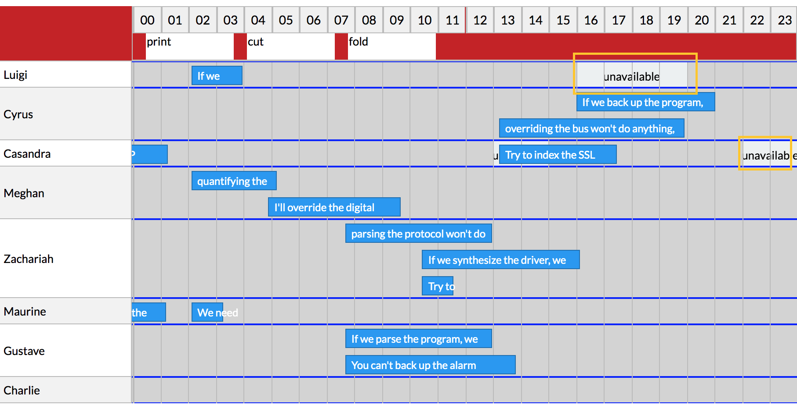

# Summary

Add an API to the calendar part of the timeline. This API would give you control to add custom UI on calendar rows using a render prop. You can control what is rendered by default with the library like Items and Vertical/Horizontal lines, and the renderer will provide you the ability to render custom backgrounds and droppable layers for custom dnd (more application bellow).

# Basic example

```javascript
<Timeline
    groups={groups}
    items={items}
    rowRenderer={({ rowData, helpers, getLayerRootProps, group }) => {
        const { itemsToDrag, unavailableSlots, timelineLinks } = rowData
        const groupUnavailableSlots = unavailableSlots[group.id]
        ? unavailableSlots[group.id]
        : []
        return (
        <>
            <UnavailableLayer
                getLayerRootProps={getLayerRootProps}
                getLeftOffsetFromDate={helpers.getLeftOffsetFromDate}
                groupUnavailableSlots={groupUnavailableSlots}
            />
            <DroppablesLayer
                getLayerRootProps={getLayerRootProps}
                itemsToDrag={itemsToDrag}
                getLeftOffsetFromDate={helpers.getLeftOffsetFromDate}
                handleDrop={this.handleDrop}
                group={group}
            />
        </>
        )
    }}
    rowData={{
        itemsToDrag: this.state.itemsToDrag,
        unavailableSlots: this.state.unavailableSlots,
        timelineLinks: this.state.timelineLinks,
    }}
/>
```

_note: this follows the [limited control approach](#limit-control-to-rowrender)_




# Motivation

- add custom layers like unavailable slots, drag and drop into the calendar and gantt.
- get rid of the top position of the item be based on the whole calendar part not per row
- enable row virtual scrolling
- hide implementation details
- remove plugin system (undocumented)
- more test coverage 
- inversion of control (solve a lot of issues with examples rather than adding code into the library)
- get rid of z-index limitations
- get rid of extra renders to the calendar when we move an item

# Detailed design

<!-- This is the bulk of the RFC. Explain the design in enough detail for somebody
familiar with React to understand, and for somebody familiar with the
implementation to implement. This should get into specifics and corner-cases,
and include examples of how the feature is used. Any new terminology should be
defined here. -->

This RFC will change how we render the *calendar* part of the component.

_*Old approach*_

The old approach deals with The calendar part as a group of layers positioned on top of each other using absolute positioning to place items, rows and rows using `top` and `left` properties with relative to the whole calendar `div`

```
<Calendar>
    <Columns/>
    <Rows/>
    <Items/>
</Calendar>
```

_*New approach*_

The new approach with `rowRenderers` here would split the Calendar part to rows instead of layers and each row here would consist of an item layer, columns layer and any other layer the user would like to add. This will make the positioning of the layers relative to the row `div` and not the whole calendar `div`.

```typescript
<Calendar>
    <FirstRow>
        <RowItems/>
        <Columns/>
        <PlaceholderLayer/>
        <GanttLayer/>
    </FirstRow>
    <SecondRow>
        <RowItems/>
        <Columns/>
        <PlaceholderLayer/>
        <GanttLayer/>
    </SecondRow>
</Calendar>
```

## API

I will be presenting different approaches here of how would we implement the `rowRendererProp`

_please note that both approaches would give helper methods for calculating postions like `getXPositionFromTime`, `getTimeFromXPosition`, `getItemAbsoluteDimensions` and `getItemsDimensions`_

### Prop getters

```javascript
<Timeline
 rowRenderer={({getRootProps, itemLayer, columnLayer, getXPostionFromTime, getTimeFromXPostion, getItemAbsoluteDimensions, getLayerProps})=>{
    <div {...getRootProps()}>
        {itemLayer}
        {columnLayer}
        <div {...getLayerProps()}>
            droppable layer
        </div>
    </div>
 }}
/>
```

#### cons
- no control over rendered items,columns...

### Compostion

```javascript
<Timeline
 rowRenderer={({getRootProps, getItemsLayerProps, getColumnsLayerProps, getXPostionFromTime, getTimeFromXPostion, getItemAbsoluteDimensions})=>{
    <div {...getRootProps()}>
        <Items {...getItemsLayerProps()}>
        <Columns {...getColumnsLayerProps()}>
        <Layer {...getLayerProps()}>droppable area</Layer>
        <Layer {...getLayerProps()}>machine downtime</Layer>
    </div>
 }}
/>
```

### Limit control to `rowRender`

This approach will render the extra layers you pass to the row renderer but the rowRenderer will not be responsible for rendering the items and the columns layers.


```javascript
<Timeline
 rowRenderer={({getXPostionFromTime, getTimeFromXPostion, getItemAbsoluteDimensions})=>{
    <React.Fragment>
        <div {...getdivProps()}>droppable area</div>
        <div {...getdivProps()}>machine downtime</div>
    <React.Fragment>
}}
/>
```

the result of the render function will be rendered bellow the two other layers. This will limit the user from maybe rendering the core layers incorrectly but will limit the inversion of control they own and we will need to keep some props to that are being passed to the timeline instead of taking advantage of the prop getters for the column and items layer

#### Cons
- can't control z-index
- can't control row root div (might be important for virtual scrolling)

## Use cases 

- Drag and drop from outside to the calendar to inside (specific target or anywhere in the row).
- Placeholder Items thought the scheduler.
- Virtual scrolling (maybe)
- Gantt (maybe).

# Drawbacks

- huge code change
- changes the mental image of how the library renders
- need a lot of testing
- removes plugins
- might have some issues aligning everything especially vertical lines
- remove some props (TODO: get the props which will change)
- add complexity to library usage for custom changes
- render vertical components that could cover more than 1 row
- added layers might block some actions
- adding stop propagation for item events (or any other layers)
- item can't keep its state because of re-parenting

There are tradeoffs to choosing any path. Attempt to identify them here.

# Alternatives

- keep the plugin system (undocumented)

# Adoption strategy

<!-- If we implement this proposal, how will existing React developers adopt it? Is
this a breaking change? Can we write a codemod? Should we coordinate with
other projects or libraries? -->

- Documentation on the new features
- Codesandox examples
- Migration guide

<!-- # How we teach this

What names and terminology work best for these concepts and why? How is this
idea best presented? As a continuation of existing React patterns?

- Documentation on the new features
- Codesandox examples
- Migration guide -->

# Issues might resolved

- [#623](https://github.com/namespace-ee/react-calendar-timeline/issues/623)
- [#338](https://github.com/namespace-ee/react-calendar-timeline/issues/338)
- [#156](https://github.com/namespace-ee/react-calendar-timeline/issues/156)
- [#636](https://github.com/namespace-ee/react-calendar-timeline/issues/636)
- [#644](https://github.com/namespace-ee/react-calendar-timeline/issues/644)
- [#477](https://github.com/namespace-ee/react-calendar-timeline/issues/477)
- [#595](https://github.com/namespace-ee/react-calendar-timeline/issues/595)

# Unresolved questions

When too much control is too much control?
